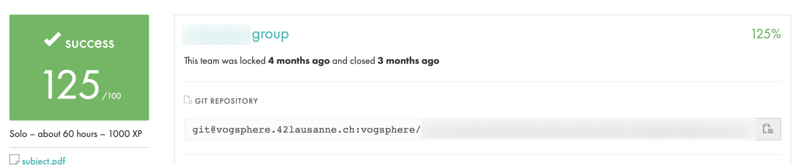

# so_long



## Description

`so_long` is a small `2D` game project developed as part of the `42 cursus`. The goal of the project is to create a simple game using the `MiniLibX` library, where the player navigates a maze-like map, collects items, and reaches the exit while avoiding enemies.

## Features

- 2D grid-based movement
- Map parsing from a `.ber` file
- Player movement using keyboard inputs
- Collectible items
- Exit that opens when all items are collected
- Enemy movement (optional feature)
- Basic animations and textures

## Installation

1. Clone the repository:
   ```sh
   git clone https://github.com/serg-backend-developer/so_long.git
   cd so_long
   ```
2. Compile the project:
   ```sh
   make
   ```

## Usage

Run the game with a valid map file:
```sh
./so_long maps/map.ber
```

### Controls
- `W` / `A` / `S` / `D` - Move the player
- `ESC` - Exit the game

## Map Format
The game uses a `.ber` file to define the map. The map must:
- Be rectangular
- Be surrounded by walls (`1`)
- Have at least one exit (`E`)
- Have at least one collectible (`C`)
- Have exactly one player starting position (`P`)
- Have at least one enemy (`M`)

Example map:
```
111111
1P0C01
1000E1
111111
```

## Dependencies
- MiniLibX (included in the repository)
- `make`, `gcc`, and standard libraries
